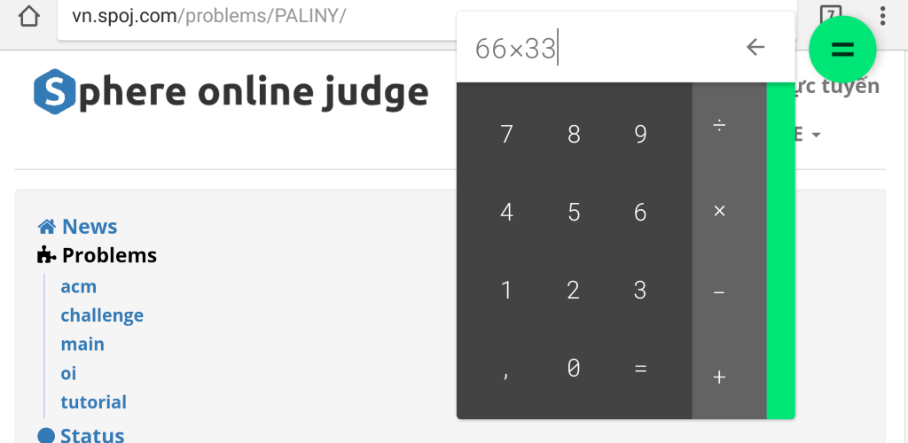

# Floating Calculator

## Overview

Material floating calculator that opens as a small window floating over other apps!

Perform calculations instantly while browsing the web, reading books, watching movies, playing games or while attending a call!

## Main feature

1. Material themes.
2. Multi color.
3. Quick tile (Android N and above)

## License

    Copyright (c) 2017 by Tran Le Duy
    
    Licensed under the Apache License, Version 2.0 (the "License");
    you may not use this file except in compliance with the License.
    You may obtain a copy of the License at
    
        http://www.apache.org/licenses/LICENSE-2.0
    
    Unless required by applicable law or agreed to in writing, software
    distributed under the License is distributed on an "AS IS" BASIS,
    WITHOUT WARRANTIES OR CONDITIONS OF ANY KIND, either express or implied.
    See the License for the specific language governing permissions and
    limitations under the License.
